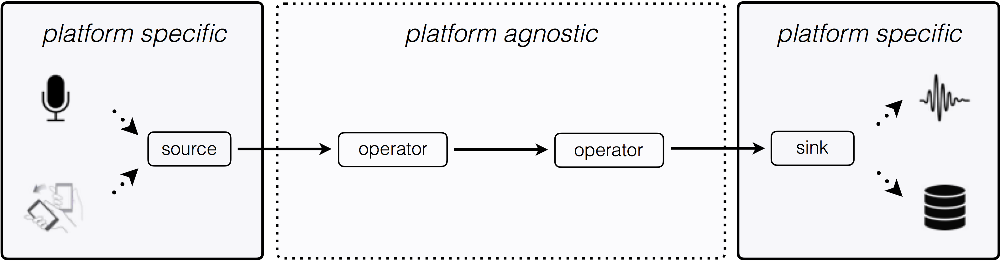
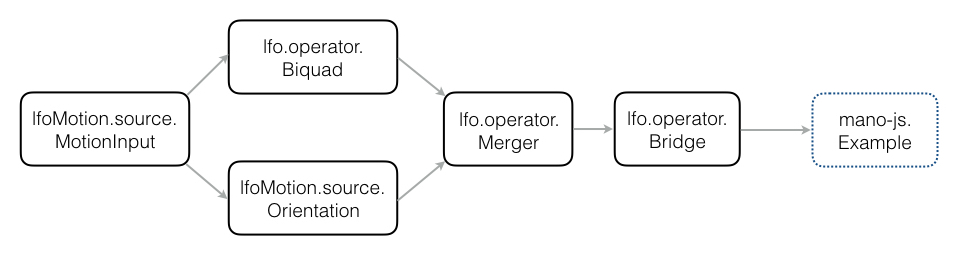
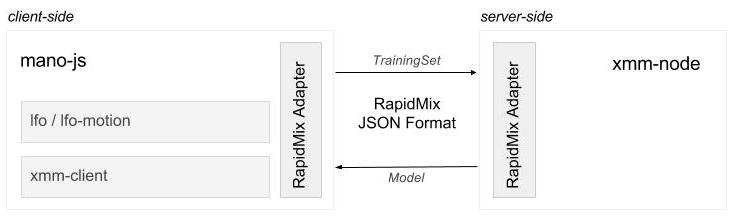

# ISMM - JS Libraries

## Pre-processing

### waves-lfo

- sources: https://github.com/wavesjs/waves-lfo
- documentation: http://wavesjs.github.io/waves-lfo/

Lfo provides a graph-based (data-flow) javascript API designed for the processing and analysis of signals and data streams such as audio, motion sensors data and descriptors.

The library can be used online as well as offline and provides platform specific abstractions (sources and sinks) that makes it usable in browsers and nodeJS. 

The library provides 3 types of modules:
- **source** modules produce streams and propagate their properties (i.e. frameRate, frameType, etc.) through the graph.
- **sink** modules are endpoints of the graph such as recorders and visualizers.
- **operator** modules process an incoming stream and propagate the resulting stream to the next operators.

A **graph** is a combination of at least a **source** and a **sink** with any number of _operator_ modules in between:



Available operators are mostly composed of audio descriptors, filters, and data-flow operators

#### Some examples

- [VuMeter](https://cdn.rawgit.com/wavesjs/waves-lfo/master/examples/sink-vu-meter-display/index.html)
- [MovingAverage](https://cdn.rawgit.com/wavesjs/waves-lfo/master/examples/sink-bridge/index.html)
- [WaveformDisplay](https://cdn.rawgit.com/wavesjs/waves-lfo/master/examples/sink-waveform-display/index.html)
- [Mosaicing](https://cdn.rawgit.com/wavesjs/waves-lfo/master/examples/mosaicking/index.html)

### lfo-motion

- sources: https://github.com/Ircam-RnD/lfo-motion/
- documentation: https://ircam-rnd.github.io/lfo-motion/

**lfo-motion** is designed as a plugin for **waves-lfo** containing a set of sources and operators dedicated to motion sensors capture, filtering and movement analysis.

Using these modules implies to to install the **waves-lfo** library as a dependency, i.e.:

```
npm install --save waves-lfo
npm install --save ircam-rnd/lfo-motion
```

The library can be used when maximum granularity and parameter controls on the stream processing is necessary.

_note:__ The library can also be used alongside the **mano-js** machine learning abstractions as a replacement for the `ProcessedSensors` class. This is achieved by feeding the output data of the graph to the mano-js Example.



#### Examples

@todo

## Machine-learning

The **xmm-client** and **xmm-node** libraries are based on the original **XMM** library written by Jules Françoise, hosted on github : https://github.com/Ircam-RnD/xmm

> “XMM is a portable, cross-platform C++ library that implements Gaussian Mixture Models and Hidden Markov Models for recognition and regression. The XMM library was developed for movement interaction in creative applications and implements an interactive machine learning workflow with fast training and continuous, real-time inference.”

It is built around 3 base classes : `Phrase`, `TrainingSet` and `Model`.

The `Phrase` represents a recorded gesture example, the `TrainingSet` represents a set of `Phrase` instances that all have the same dimensions, and the `Model` represents a gesture model, created by training from a `TrainingSet`, and allowing real-time gesture recognition when it is trained.

### xmm-client

- sources: https://github.com/Ircam-RnD/xmm-client
- documentation: https://ircam-rnd.github.io/xmm-client/

**xmm-client** is a client-side JavaScript reimplementation of parts of the original **XMM** library.

The only missing functional part in xmm-client is the possibility to train a model from a training set and some configuration parameters. This is what **xmm-node** has been developed for.

### xmm-node

- sources and documentation : https://github.com/Ircam-RnD/xmm-node

**xmm-node** is a native addon for Node.js that wraps the original **XMM** library.

It has a single class, `xmm`, which contains its own training set and model.
This single class can perform every operation permitted by **XMM**.

## Communication Formats

### JSON format specification

- documentation: https://www.doc.gold.ac.uk/eavi/rapidmixapi.com/index.php/documentation/json-documentation/

The JSON format aimed at the exchange of training examples, training sets, machine learning configurations, machine learning models, and signal processing blocks between software components of the RapidMix API. cf. **rapid-mix-adapters**

### rapid-mix-adapters

- source: https://github.com/Ircam-RnD/rapid-mix-adapters
- documentation: https://ircam-rnd.github.io/rapid-mix-adapters/

**rapid-mix-adapters** is a collection of translation functions that transform XMM JSON formats into RapidMix JSON formats, and vice versa. It also provides some adapters for RapidLib. It allows to make the RapidMix JSON format specification evolve independently of the rest of the JavaScript API without having to worry too much about introducing breaking changes.

## High-Level abstractions

### mano-js

- sources: https://github.com/Ircam-RnD/mano-js
- documentation: https://ircam-rnd.github.io/mano-js/

**mano-js** aims at providing an high-level abstraction around all the libraries described above. It consists of four classes that allows to implement interactive machine in a few lines of code. 

For now, the machine learning side of the library is based on **xmm-client** and **xmm-server**, which requires the setup of a nodeJS server for the training.



